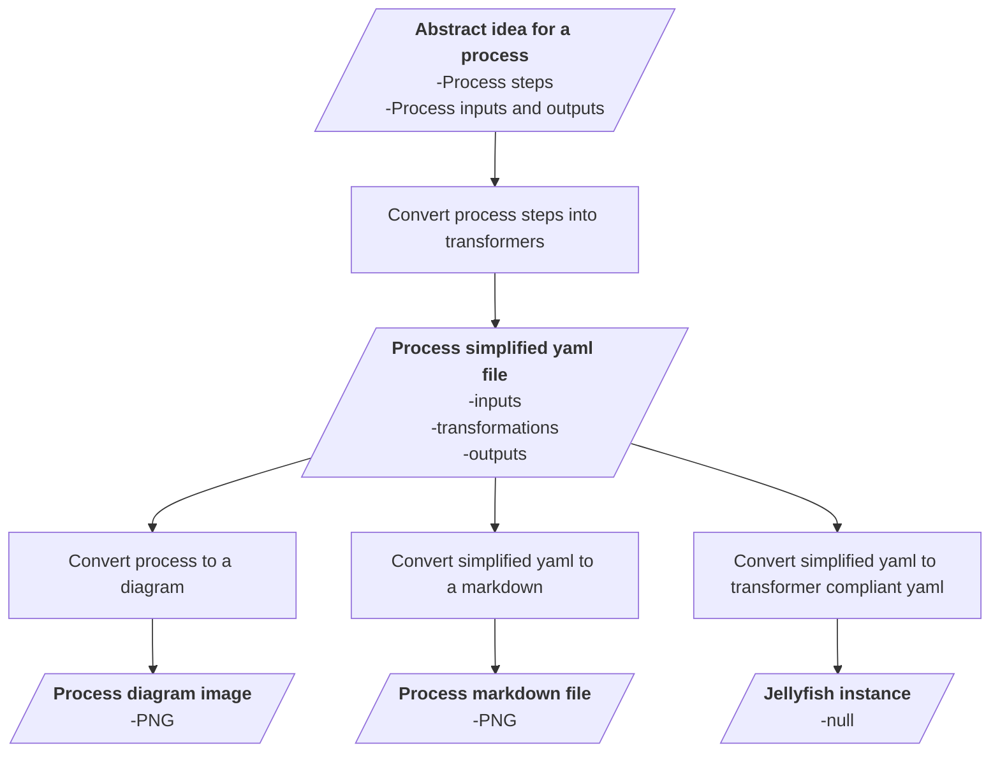

```mermaid
graph
IO0[/<b>Abstract idea for a process</b><br/>-Process steps<br/>-Process inputs and outputs/]
IO1[/<b>Process simplified yaml file</b><br/>-inputs<br/>-transformations<br/>-outputs/]
IO2[/<b>Process diagram image</b><br/>-PNG/]
IO3[/<b>Process markdown file</b><br/>-PNG/]
IO4[/<b>Jellyfish instance</b><br/>-null/]
IO0 --> T0[Convert process steps into transformers] --> IO1
IO1 --> T1[Convert process to a diagram] --> IO2
IO1 --> T2[Convert simplified yaml to a markdown] --> IO3
IO1 --> T3[Convert simplified yaml to transformer compliant yaml] --> IO4

```
